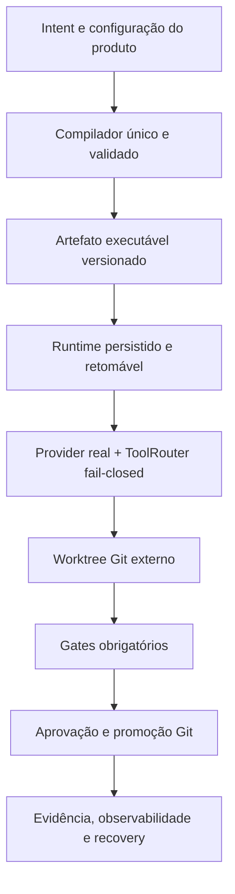

# Especificação Arquitetural — AI Engineering Harness

> **Status: Arquitetura-alvo / Em desenvolvimento**
> **Revisão documental:** 1.0.0 — não confundir com package ou schema version

## 1. Visão do produto

O produto pretende ser uma infraestrutura local-first instalável por CLI ou IDE. Um repositório
externo deverá receber configuração leve em `.harness/`, enquanto execução, ferramentas, Git,
políticas e evidências permanecerão controlados pelo motor instalado.

No estado atual, essa visão está parcialmente materializada como harness de testes e contratos. O
projeto ainda não oferece isolamento ou autonomia suficientes para uso cotidiano sem supervisão.

## 2. Arquitetura-alvo

## 3. Mapeamento atual

| Camada | Base existente | Estado | Limite principal |
|---|---|---|---|
| Package e defaults | `pyproject.toml`, `uv.lock`, `src/ai_engineering_harness/defaults/` | Implementada como base | Distribuição de produto e compatibilidade externa ainda não fechadas |
| Contratos | `src/ai_engineering_harness/contracts/` | Implementada como modelos internos | Modelos canônicos GraphSpec/PolicySpec/CompiledArtifact ainda serão unificados |
| Compilação | `compiler/` e `src/ai_engineering_harness/compiler/` | Experimental | Dois compiladores e validações incompletas |
| Runtime | `src/ai_engineering_harness/runtime/` | Experimental | Ordem fixa, adapters simulados e promoção dry-run |
| Ferramentas/modelos | `tools/`, `models/`, `indexer/` | Experimental | Terminal seguro existe como primitivo, mas registry operacional, edição e memória real ainda faltam |
| Verificação | `verification/` | Experimental | Gates estáticos usam o terminal confinado; fail-closed integral e matriz completa ainda faltam |
| Governança/segurança | `governance/`, `security/` | Experimental | Enforcement não cobre todo side effect |
| Auditoria | `observability/audit.py` | Experimental | Hash chain local não prova efeitos externos nem recovery |
| Workspace Git | `workspace/` | Implementada como primitivo | Cria/valida worktree Git externo e guard canônico; integração com lifecycle/tools ainda falta |

## 4. Separação Harness vs. produto

- **Motor instalado:** código sob `src/ai_engineering_harness/`, contratos, defaults e CLI.
- **Configuração do produto:** `.harness/agents/`, `.harness/graphs/specs/`,
  `.harness/policies/` e `.harness/tools/`.
- **Estado local:** `.harness/state/` e `.harness/artifacts/`.
- **Isolamento disponível como primitivo:** worktree Git externo associado a `execution_id`; uso pelo
  lifecycle e pelas tools continua pendente.

`harness init` cria/copia a estrutura local, mas isso não torna o repositório governado ou seguro por
si só.

## 5. Invariantes do contrato final

- nenhuma escrita fora do worktree autorizado;
- comandos como `argv: list[str]`, `shell=False`;
- gate obrigatório ausente ou não executado termina em erro;
- adapters indisponíveis falham com erro tipado;
- dry-run não usa semântica de promoção concluída;
- aprovação, orçamento e política controlam side effects;
- secrets são redigidos antes da persistência;
- estado necessário para retomar sobrevive a crash;
- promoção e rollback usam operações Git explícitas com SHAs reais.

Essas invariantes são requisitos do plano. Enquanto qualquer uma não estiver garantida no caminho
crítico, o projeto permanece protótipo.
