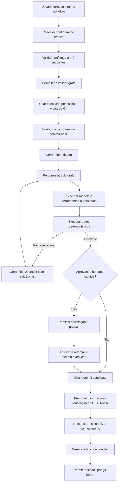

# Plano de Implementação — AI Engineering Harness Operacional

> Documento executivo para transformar o projeto atual de protótipo arquitetural em um harness local-first funcional, seguro, recuperável e verificável.

## 0. Metadados do plano

- **Projeto:** `ai-engineering-harness`
- **Estado atual considerado:** pacote Python `0.1.0`, runtime e integrações parcialmente simulados
- **Objetivo do plano:** tornar concreta a proposta do harness, eliminando caminhos falsamente bem-sucedidos, conectando todos os componentes ao fluxo principal e entregando uma vertical slice real antes de ampliar escopo
- **Estratégia:** Python-first, local-first, fail-closed e incremental
- **Resultado final esperado:** um repositório externo poderá ser inicializado, analisado, modificado em worktree isolado, verificado, aprovado, promovido e eventualmente revertido com evidência auditável

---

## 1. Como usar este documento

Este documento deve ser usado como especificação de execução. Cada tarefa possui:

- objetivo;
- implementação necessária;
- arquivos ou módulos envolvidos;
- critérios de aceite verificáveis;
- testes obrigatórios;
- dependências de outras tarefas.

Regras de execução:

1. Não iniciar uma fase enquanto os gates de saída da fase anterior não estiverem verdes.
2. Não substituir integração ausente por retorno simulado em código de produção.
3. Test doubles só podem existir sob `tests/` ou em módulos explicitamente marcados como testing.
4. Nenhum comando pode declarar sucesso sem produzir e validar o efeito correspondente.
5. Toda decisão que alterar este plano deve ser registrada em ADR.
6. Cada tarefa concluída deve atualizar testes e documentação na mesma mudança.
7. Antes de qualquer implementação, ler `TASK.md` e a seção correspondente à fase ativa neste documento.
8. Apenas um agente pode atuar como executor/escritor por vez; os demais devem permanecer em modo de auditoria somente-leitura.
9. Antes da F0.1, concluir o preflight F0.0 e registrar no `TASK.md` o comando Python efetivamente disponível.
10. Se `.git` não existir, não executar comandos Git e não criar um repositório automaticamente; registrar bloqueio e solicitar decisão explícita sobre restaurar o histórico ou criar um baseline.
11. Não assumir que `python`, `py` ou `uv` existem. O executor deve detectar o ambiente e reutilizar o comando registrado no checkpoint.
12. Não usar números de linha como referência permanente entre documentos; usar IDs de fase, IDs de tarefa e headings.

### 1.1 Ciclo Git obrigatório por tarefa

A partir da F2.1, cada tarefa de implementação deve percorrer isoladamente o ciclo abaixo. O objetivo
é manter `main` sempre validada, reduzir o tamanho dos PRs e permitir diagnóstico ou rollback de uma
tarefa sem reverter a fase inteira.

1. Confirmar que a tarefa anterior foi incorporada à `main`, que `main` está sincronizada com
   `origin/main` e que o CI obrigatório do HEAD está verde.
2. Criar uma branch exclusiva a partir dessa `main`, com nome `task/<id>-<descricao-curta>`; nunca
   iniciar a próxima tarefa a partir de uma branch ainda não incorporada.
3. Preparar o dossiê de defensabilidade e o checkpoint `READY` na própria branch antes do primeiro
   arquivo de implementação.
4. Implementar somente o escopo congelado, em commits pequenos e semanticamente identificáveis;
   checkpoints não substituem commits nem testes.
5. Executar aceite focado, regressão aplicável, quality gates, build/smoke exigidos e auditoria de
   escopo antes de publicar a branch.
6. Atualizar o dossiê ativo com resultado, arquivos, comandos, decisões, rollback e checkpoint;
   manter no `TASK.md` somente estado corrente, bloqueios, última promoção e próxima ação. Nunca
   registrar antecipadamente PR, CI ou merge ainda não realizados.
7. Publicar uma única branch e abrir um único PR da tarefa para `main`, somente com autorização
   explícita do usuário. É proibido push direto em `main`, force-push, bypass administrativo ou
   enfraquecimento de proteção/check obrigatório.
8. Exigir branch atualizada e `CI required=success`. Preferir merge commit para preservar os commits
   e permitir revert do merge completo; squash/rebase de histórico exige decisão explícita registrada.
9. Depois do merge, confirmar no Git/GitHub a CI de `push` verde no SHA exato de `main` e sincronizar
   o checkout. Sem iniciar a tarefa seguinte, criar imediatamente `docs/promote-<id>` a partir dessa
   `main` e registrar PR/checks/merge/run no dossiê anterior, marcá-lo `PROMOTED`, movê-lo para
   `docs/tasks/completed/` e atualizar índice, painel, README e testes de estado.
10. A reconciliação usa um PR administrativo exclusivamente documental. Ele não conta como segundo PR
    de implementação da tarefa, não pode alterar produto/dependências/schemas/CI e continua sujeito a
    autorização explícita para push, abertura e merge. A próxima implementação só pode começar depois
    que esse PR e sua CI pós-merge também estiverem verdes. O PR administrativo não certifica o próprio
    merge por outro PR; sua finalidade termina ao publicar a evidência da tarefa promovida.
11. A branch remota concluída pode ser removida após o merge; commits, PR e checkpoints preservam o
    histórico. Tags remotas, PR, merge, exclusão de branch ou mudança de proteção continuam efeitos
    externos que exigem autorização explícita.

Mudanças exclusivamente documentais e transversais usam branch `docs/<descricao-curta>` e um único PR
próprio. Gate, implementação documental, validação e estado local final permanecem nesse PR. A branch
administrativa `docs/promote-<id>` é a exceção restrita definida pela DEC-014: ela fecha a evidência da
tarefa de implementação recém-promovida e não abre uma nova tarefa de produto.

A F1, concluída linearmente antes desta regra, foi promovida por um único PR e constitui a única
exceção planejada. Os PRs #17 e #18 são um desvio histórico de fechamento recursivo de
`DOC-TASK-LEDGER`: todos respeitaram checks e CI pós-merge, mas não criam precedente. O próprio commit
documental que adotou a regra acompanhou a branch da F1 antes desse PR. Nenhuma tarefa da F2 começou
antes dessa promoção e do CI pós-merge verde.

### 1.2 Contrato normativo do dossiê e do gate `READY`

Este contrato define quando há evidência suficiente para autorizar uma implementação. Ele não
substitui nem reduz os requisitos e critérios da tarefa no restante deste plano. Enquanto qualquer
campo obrigatório estiver ausente ou sem evidência, o gate permanece `BLOCKED` e nenhum arquivo de
implementação pode ser alterado; é permitida apenas a preparação documental do próprio dossiê.

| Condição | Evidência mínima obrigatória |
|---|---|
| **Problema comprovado** | Comando e saída reproduzível, teste/import/compilação falhando ou referência exata a arquivo e trecho. Impressão, hipótese ou intenção do plano não bastam. |
| **Baseline conhecido** | Branch, `HEAD`, `git status --short`, upstream/CI aplicável e mudanças preexistentes registrados; trabalho alheio preservado e excluído do escopo. |
| **Escopo congelado** | Objetivo, arquivos/áreas permitidos, itens proibidos, dependências e efeitos esperados definidos antes da primeira edição de implementação. |
| **Critérios congelados** | Comandos exatos, resultado esperado e condição de falha definidos antes da implementação; critério não pode ser enfraquecido para passar. |
| **Rollback executável** | Checkpoint Git existente, gatilhos para interromper/reverter, procedimento não destrutivo e verificação pós-rollback. |
| **Responsabilidade explícita** | Executor único, data/hora da autorização, estado do gate e runtime efetivamente utilizado. |

O dossiê ativo deve conter, no mínimo, o equivalente aos campos abaixo. Markdown é permitido, mas
omitir a semântica de qualquer campo mantém o gate `BLOCKED`.

```yaml
defensibility:
  task_id: "F0.x"
  gate: "BLOCKED | READY"
  lifecycle: "PREPARING | ACTIVE | COMPLETED_LOCAL | PROMOTION_PENDING | PROMOTED"
  executor: "nome"
  authorized_at: "YYYY-MM-DDTHH:MM:SS-03:00"
  problem_statement: "fato observável que precisa ser corrigido"
  evidence:
    - command: "comando read-only ou teste de reprodução"
      observed: "exit code e resultado relevante"
      location: "arquivo:linha, quando aplicável"
  baseline:
    branch: "branch atual"
    head: "commit completo"
    status: "clean ou mudanças preexistentes preservadas"
    upstream_ci: "run e resultado, quando aplicável"
    checkpoint: "tag ou commit existente"
  frozen_scope:
    allowed: ["arquivos/áreas autorizados"]
    excluded: ["itens explicitamente fora de escopo"]
  frozen_acceptance:
    - command: "comando exato"
      expected: "exit code e resultado esperado"
  rollback:
    triggers: ["condições objetivas para interromper ou reverter"]
    procedure: "git revert ou inversão explícita e não destrutiva dos hunks"
    verify: "comandos que comprovam retorno ao baseline funcional"
```

Regras de congelamento e mudança de escopo:

1. Somente quando todas as condições estiverem satisfeitas o gate muda de `BLOCKED` para `READY`; o
   checkpoint dessa transição deve existir antes do primeiro arquivo de implementação.
2. Descoberta que exija novo arquivo, efeito, dependência ou mudança de critério interrompe a execução
   e exige registrar a descoberta e recongelar escopo, aceite e rollback.
3. Ampliação material exige novo checkpoint antes da retomada.
4. Nunca remover, ignorar ou tornar mais fraco um critério que falhou. Corrigir a implementação ou
   registrar bloqueio.
5. Rollback não autoriza `git reset --hard`, descarte amplo ou sobrescrita de trabalho preexistente.
   Preferir commits isolados e `git revert`; restauração destrutiva exige autorização explícita e alvo
   previamente verificado.
6. Após os gates locais, o dossiê passa a `COMPLETED_LOCAL / PROMOTION_PENDING`, mas a tarefa seguinte
   continua bloqueada até merge e CI pós-merge verdes serem observados.
7. Após observar merge e CI pós-merge, executar a reconciliação administrativa da DEC-014, preencher
   PR/checks/merge/CI, marcar `PROMOTED` e arquivar o dossiê antes de criar o próximo `READY`.
8. Um commit não antecipa prova do próprio merge. A reconciliação registra somente a promoção da tarefa
   anterior; seu PR administrativo termina a cadeia e não gera outra reconciliação recursiva.

Checklist mínimo de liberação:

```text
[ ] Problema comprovado com evidência reproduzível
[ ] Baseline Git, upstream/CI e mudanças preexistentes registrados
[ ] Escopo permitido e proibido congelados
[ ] Critérios exatos, resultados esperados e condições de falha congelados
[ ] Checkpoint e rollback verificável existentes
[ ] Executor único, runtime e horário de autorização registrados
```

---

## 2. Definição do produto a ser entregue

O harness será considerado funcional quando executar este fluxo real:



### 2.1 Resultado mínimo observável

Uma execução concluída deverá possuir, no mínimo:

```text
.harness/state/executions/<execution_id>/
├── execution.json
├── context.json
├── plan.json
├── workflow-state.json
├── event-journal.jsonl
├── approval-request.json        # quando aplicável
├── verification-results.json
├── tool-invocations.jsonl
└── evidence.json
```

O `evidence.json` deverá referenciar por digest todos os artefatos utilizados para declarar a execução como concluída.

---

## 3. Decisões arquiteturais obrigatórias

### 3.1 Runtime nativo como núcleo

Para esta implementação, o runtime determinístico do próprio harness será a fonte de verdade.

- O artefato compilado deve declarar `runtime_provider: harness-native`.
- O termo `MAF` só poderá aparecer como provider ativo depois que existir um adapter real, com teste de conformidade.
- Até lá, remover alegações de que Microsoft Agent Framework executa o fluxo.
- Uma futura integração MAF deverá consumir o mesmo contrato compilado, sem criar um segundo formato incompatível.

### 3.2 Uma única implementação por capacidade

- Um único compilador oficial em `src/ai_engineering_harness/compiler/`.
- Um único resolvedor de configuração.
- Um único catálogo de contratos.
- Um único schema de evento de execução.
- Um único mecanismo de permissões de ferramentas.
- Scripts na raiz poderão ser apenas wrappers finos que chamam o pacote instalado.

### 3.3 Falha fechada

O sistema deverá falhar explicitamente quando encontrar:

- provider não configurado;
- tool desconhecida;
- gate desconhecido ou indisponível;
- política ausente;
- contrato ausente;
- grafo com aresta inválida;
- execução sem worktree válido;
- commit-base divergente;
- journal corrompido;
- artefato com versão incompatível;
- dependência obrigatória não instalada.

É proibido converter essas condições em sucesso, pular silenciosamente a etapa ou produzir SHA sintético com semântica de promoção real.

### 3.4 Estado explícito e retomável

Toda execução será uma máquina de estados persistida e reconstituível por replay de eventos. O processo poderá morrer e ser retomado sem reiniciar do zero ou declarar uma etapa não executada como concluída.

### 3.5 Isolamento antes de autonomia

Nenhum agente poderá modificar o checkout original. Toda escrita ocorrerá dentro de um worktree externo associado ao `execution_id`.

---

## 4. Escopo e não escopo

### 4.1 Escopo do MVP operacional

- Projetos Python versionados com Git.
- Execução local em uma única máquina.
- Um workflow completo: `new-feature`.
- Providers reais: um provider remoto e um provider local, desde que configurados.
- Ferramentas: leitura de arquivos, edição confinada, terminal sem shell e operações Git controladas.
- Gates: typecheck, lint, unit tests e build.
- Aprovação pausável e retomável.
- Promoção por commit Git.
- Persistência local atômica.
- Auditoria estruturada e redigida.
- CLI completa para operar e inspecionar a execução.

### 4.2 Fora do MVP

- Execução distribuída em múltiplos hosts.
- Kubernetes, Redis ou fila remota obrigatória.
- Deploy automático em produção.
- Resposta real a incidentes de produção.
- Canary deployment e observação de SLOs reais.
- Suporte completo a Python, Node, Go, Rust e Java simultaneamente.
- Interface web.
- Multiagente paralelo.

Os grafos `incident`, `migration`, `bug-fix` e `refactoring` deverão permanecer marcados como `experimental` até possuírem E2E próprios.

---

## 5. Invariantes de implementação

1. **Reprodutibilidade:** o mesmo grafo e as mesmas políticas devem produzir o mesmo digest de artefato compilado.
2. **Confinamento:** paths fornecidos por modelo ou usuário devem ser resolvidos e validados dentro do worktree.
3. **Sem shell implícito:** comandos devem ser representados como `argv: list[str]` e executados com `shell=False`.
4. **Sem sucesso vazio:** gate obrigatório que não executou deve ser `ERROR`, nunca `PASSED`.
5. **Sem mocks em produção:** adapters reais devem falhar com erro tipado quando indisponíveis.
6. **Sem promoção sintética:** dry-run deve terminar em estado `DRY_RUN_COMPLETED`, não `COMPLETED` ou `PROMOTED`.
7. **Sem alteração silenciosa do checkout original:** promoção só por operação Git explícita e auditada.
8. **Sem segredo persistido:** prompts, stdout, stderr, journal e evidências devem passar pelo redactor antes da gravação.
9. **Sem estado apenas em memória:** estado necessário para retomar uma execução deve ser persistido.
10. **Sem versão duplicada:** versão do pacote vem de uma única fonte; versões de schema são campos separados.
11. **Sem política decorativa:** toda política compilada deve possuir enforcement correspondente ou ser rejeitada.
12. **Sem documentação aspiracional apresentada como pronta:** capacidades futuras devem ser marcadas como planejadas ou experimentais.

---

## 6. Arquitetura-alvo de módulos

```text
src/ai_engineering_harness/
├── cli/
│   ├── main.py
│   └── commands/
├── config/
│   ├── resolver.py
│   └── schemas.py
├── contracts/
│   ├── graph.py
│   ├── execution.py
│   ├── policies.py
│   ├── tools.py
│   └── verification.py
├── compiler/
│   ├── compiler.py
│   ├── resolver.py
│   ├── validators.py
│   └── artifact.py
├── runtime/
│   ├── engine.py
│   ├── graph_executor.py
│   ├── node_executors.py
│   ├── state_machine.py
│   ├── recovery.py
│   └── retry.py
├── persistence/
│   ├── base.py
│   ├── atomic_file.py
│   └── locks.py
├── models/
│   ├── provider.py
│   ├── registry.py
│   ├── router.py
│   └── adapters/
├── tools/
│   ├── router.py
│   ├── registry.py
│   ├── path_guard.py
│   └── adapters/
├── workspace/
│   ├── git_repository.py
│   └── git_worktree.py
├── verification/
├── governance/
├── observability/
├── indexer/
├── knowledge/
├── doctor/
└── defaults/
```

Não é obrigatório mover todos os arquivos imediatamente. A estrutura representa os limites que deverão existir ao final.

---

# 7. Plano de execução por fases

## Fase 0 — Baseline honesta, executável e reproduzível

### Objetivo

Garantir que o pacote compile, instale, rode testes de forma reproduzível e não anuncie capacidades inexistentes.

### Tarefa F0.0 — Preflight do workspace e coordenação dos agentes

**Implementação**

- Identificar e registrar no `TASK.md` um único executor ativo; demais agentes ficam em auditoria somente-leitura.
- Detectar quais comandos estão realmente disponíveis para Python e ambiente: `uv`, `python` e, no Windows, `py`.
- Selecionar um comando Python com versão `>=3.11` e registrá-lo como `python_command` no checkpoint.
- Verificar se o workspace é um repositório Git com `git rev-parse --is-inside-work-tree` somente quando `.git` existir.
- Se `.git` estiver ausente, bloquear tarefas de implementação até o usuário decidir entre restaurar o clone/histórico original ou autorizar a criação de um baseline novo.
- Nunca executar `git init`, criar commit baseline, instalar runtime ou alterar o ambiente sem autorização explícita.
- Registrar paths do workspace, shell, sistema operacional e comandos selecionados para permitir retomada por outro agente.

**Critérios de aceite**

- Um único executor ativo está identificado.
- `python_command` está registrado e retorna Python `>=3.11`, ou existe bloqueio explícito de pré-requisito.
- O estado Git está registrado como `available` ou `missing`; nenhum comando Git subsequente é executado quando estiver `missing`.
- O `TASK.md` contém bloqueios, checkpoint e próxima ação coerentes com o ambiente observado.

**Testes obrigatórios**

- Retomada por outro agente consegue identificar executor, Python e estado Git sem depender do histórico da conversa.
- Ausência de `.git` não dispara `git init` nem comandos de inspeção Git em sequência.

### Tarefa F0.1 — Corrigir erros bloqueantes de código

**Implementação**

- Corrigir a assinatura inválida em `src/ai_engineering_harness/migrations/runner.py`.
- Executar `compileall` em todo código de produção e testes.
- Corrigir imports quebrados e módulos que falham apenas quando importados diretamente.
- Adicionar teste que importe todos os módulos públicos do pacote.

**Critérios de aceite**

```bash
<PYTHON_CMD> -m compileall -q src compiler tests
<PYTHON_CMD> -c "import ai_engineering_harness.migrations"
```

Ambos devem encerrar com código `0`.

`<PYTHON_CMD>` representa o comando validado e registrado na F0.0; não deve ser copiado literalmente para o shell.

**Dependência:** F0.0 concluída, com `python_command` válido e estratégia Git definida.

### Tarefa F0.2 — Padronizar encoding

**Implementação**

- Converter arquivos Python, Markdown, YAML, TOML e JSON para UTF-8 válido.
- Corrigir sequências resultantes de dupla decodificação UTF-8/Windows-1252 e equivalentes.
- Remover lógica baseada em símbolos já corrompidos.
- Adicionar `.editorconfig` com `charset = utf-8`.
- Validar CLI em Windows com console UTF-8 e console legado.

**Critérios de aceite**

- `rg '\x{00C3}|\x{00E2}\x{0153}|\x{00F0}\x{0178}' src docs README.md` não deve retornar mojibake conhecido.
- `harness --help`, `harness doctor` e mensagens de erro devem renderizar sem exceção.

### Tarefa F0.3 — Tornar o ambiente reproduzível

**Implementação**

- Escolher e documentar um gerenciador de ambiente; recomendação: `uv`.
- Criar e versionar lockfile.
- Completar dependências de desenvolvimento: pytest, pytest-cov, mypy, ruff e build.
- Usar `python -m ...` nos comandos internos quando houver módulo Python correspondente.
- Definir versões de Python suportadas na CI.
- Adicionar comandos oficiais de bootstrap no README.

**Arquivos envolvidos**

- `pyproject.toml`
- lockfile escolhido
- `README.md`

**Critérios de aceite**

Uma máquina limpa deve conseguir executar:

```bash
uv sync --all-extras
uv run python -m pytest
uv run python -m mypy src
uv run python -m ruff check .
uv run python -m build
```

### Tarefa F0.4 — Unificar versionamento

**Implementação**

- Manter uma única versão do pacote.
- Obter `__version__` por `importlib.metadata.version` ou fonte única equivalente.
- Separar claramente:
  - `package_version`;
  - `graph_schema_version`;
  - `artifact_schema_version`;
  - `policy_schema_version`.
- Remover versões conflitantes `0.1.0`, `1.0.0` e `3.2.0` quando usadas para representar a mesma coisa.

**Critérios de aceite**

- `harness --version`, metadata da wheel e `ai_engineering_harness.__version__` devem ser idênticos.
- Schemas devem ter compatibilidade testada separadamente.

### Tarefa F0.5 — Corrigir documentação de estado

**Implementação**

- Trocar todo rótulo que afirme estado produtivo por `Protótipo / Em desenvolvimento` até o gate correspondente ser atingido.
- Remover referências a arquivos inexistentes.
- Corrigir links locais absolutos dependentes do caminho da máquina.
- Criar matriz `Capacidade | Implementada | Experimental | Planejada`.
- Marcar adapters fake como dívida técnica até sua remoção.

### Tarefa F0.6 — Criar CI mínima

**Implementação**

- Criar pipeline para Windows e Linux.
- Jobs mínimos:
  - encoding e compileall;
  - ruff;
  - mypy;
  - testes unitários;
  - testes E2E locais;
  - build da wheel;
  - instalação e smoke test da wheel.
- Proibir merge quando qualquer job obrigatório falhar.

**Estado comprovado em 2026-08-04:** concluída. O PR principal `#1` passou em Windows/Linux; `main`
exige o aggregate `CI required`; o PR controlado `#2` ficou bloqueado no vermelho e foi restaurado
para verde antes de ser fechado sem merge. Evidências detalhadas e URLs permanecem no `TASK.md`.

**Gate de saída da Fase 0**

- Preflight F0.0 concluído e ambiente registrado.
- Pacote compila e instala em ambiente limpo.
- Testes podem ser reproduzidos por um único comando.
- Nenhum documento declara produção.
- Nenhum erro de sintaxe ou encoding permanece.
- CI Windows/Linux executa os gates obrigatórios e bloqueia merge quando `CI required` falha.

---

## Fase 1 — Contrato de grafo e compilador único

### Objetivo

Transformar YAMLs declarativos em artefatos executáveis, validados e determinísticos.

### Tarefa F1.1 — Definir schema tipado do grafo

**Implementação**

Criar modelos Pydantic para:

- `GraphSpec`;
- `GraphMetadata`;
- `NodeSpec`;
- `AgentNodeSpec`;
- `DeterministicNodeSpec`;
- `HumanApprovalNodeSpec`;
- `TerminalStateSpec`;
- `RetryPolicySpec`;
- `ToolPermissionSpec`;
- `CompiledGraphArtifact`.

Campos mínimos do grafo:

```yaml
graph:
  name: new-feature
  schema_version: "1.0"
  entrypoint: context_retrieval
  status: stable

nodes:
  - id: context_retrieval
    type: agent
    role: requirement_analyst
    input_contract: RetrievalRequest
    output_contract: ContextSufficiencyReport
    on_success: architecture_analysis
    on_failure: blocked_insufficient_context

terminal_states:
  - id: completed
    outcome: success
  - id: failed
    outcome: failure
```

**Regras de validação**

- IDs únicos.
- Um entrypoint existente.
- Todas as arestas apontam para nó ou terminal existente.
- Ao menos um terminal de sucesso e um de falha.
- Nenhum nó inalcançável.
- Nenhuma aresta implícita.
- Ciclos somente com `retry_policy` explícita.
- `max_iterations > 0` e condição de saída obrigatória.
- Tipo do executor compatível com os campos do nó.

### Tarefa F1.2 — Criar registry seguro de contratos

**Implementação**

- Remover carregamento arbitrário de contratos por import dinâmico de path fornecido pelo projeto.
- Registrar contratos internos por nome qualificado.
- Para contratos externos, aceitar JSON Schema ou módulo explicitamente confiável e aprovado.
- Em repositório não confiável, proibir execução de Python durante a compilação.
- Validar compatibilidade entre output do nó anterior e input do próximo quando declarada.

**Critérios de aceite**

- Um contrato inexistente falha na compilação.
- Um arquivo Python malicioso em repositório não confiável nunca é importado.
- Contratos válidos aparecem no artefato compilado com schema e digest.

### Tarefa F1.3 — Validar políticas e ferramentas

**Implementação**

- Substituir o `pass` do policy validator por validação efetiva.
- Verificar se role existe.
- Verificar se tools do agente existem no registry.
- Verificar se a política permite cada tool do nó.
- Verificar se `policy_ref` existe.
- Rejeitar política com chave desconhecida quando o schema estiver em modo estrito.
- Resolver políticas no compile-time e incluir somente a visão efetiva no artefato.

### Tarefa F1.4 — Unificar os compiladores

**Implementação**

- Tornar `src/ai_engineering_harness/compiler/compiler.py` a implementação oficial.
- Fazer `compiler/compile.py` delegar para o pacote ou removê-lo.
- Fazer `harness compile` usar todos os validators.
- Definir uma única saída: `.harness/state/compiled/<workflow>.json`.
- Corrigir `harness run` para buscar specs em `.harness/graphs/specs/`.
- Remover fallback que cria grafo temporário mínimo.

**Critérios de aceite**

- Workflow inexistente retorna erro e exit code não zero.
- `harness compile` e wrapper da raiz produzem artefatos semanticamente idênticos.
- Não existe implementação duplicada de compilação.

### Tarefa F1.5 — Artefato determinístico e versionado

**Implementação**

- Normalizar o conteúdo antes de calcular digest.
- Excluir timestamp do digest semântico.
- Incluir:
  - schema version;
  - package version;
  - graph digest;
  - policy digest;
  - contract digests;
  - source files utilizados;
  - capabilities requeridas;
  - grafo resolvido.
- Gravar artefato atomicamente.
- Validar compatibilidade de versão antes da execução.

**Testes obrigatórios da Fase 1**

- grafo válido;
- ID duplicado;
- entrypoint ausente;
- nó inalcançável;
- aresta quebrada;
- ciclo sem limite;
- policy ausente;
- role inexistente;
- tool não autorizada;
- contrato inexistente;
- tentativa de import não confiável;
- compilação determinística;
- incompatibilidade de schema.

**Gate de saída da Fase 1**

O runtime só deve receber artefatos que passaram por todas as validações, e qualquer grafo padrão distribuído no pacote deve compilar sem warning ou fallback.

---

## Fase 2 — Runtime real de grafos e persistência retomável

### Objetivo

Executar cada nó do artefato compilado, persistir todas as transições e permitir retomada após interrupção.

### Tarefa F2.1 — Criar `ExecutionRecord`

**Campos mínimos**

- `execution_id`;
- `workflow_name`;
- `artifact_digest`;
- `base_commit_sha`;
- `original_branch`;
- `worktree_path`;
- `current_node_id`;
- `current_state`;
- `attempt_by_node`;
- `created_at`;
- `updated_at`;
- `configuration_digest`;
- `approval_status`;
- `candidate_commit_sha`;
- `promotion_commit_sha`;
- `failure`.

O record deve ser persistido de forma atômica.

### Tarefa F2.2 — Criar abstração de persistência

**Implementação**

Criar `StateStorageProvider` com operações:

- `create_execution`;
- `load_execution`;
- `compare_and_set_execution`;
- `append_event`;
- `list_executions`;
- `acquire_execution_lock`;
- `release_execution_lock`.

Implementar primeiro `AtomicFileStateStorage`.

Requisitos:

- escrita em arquivo temporário;
- flush e fsync;
- replace atômico;
- lock entre processos;
- versionamento otimista por `revision`;
- recuperação de arquivo temporário abandonado;
- nenhuma gravação concorrente perdida.

SQLite poderá ser implementado depois usando o mesmo contrato.

### Tarefa F2.3 — Implementar executor de grafo

**Implementação**

Criar `GraphExecutor` responsável por:

1. carregar o nó atual;
2. validar input pelo contrato;
3. selecionar executor pelo tipo do nó;
4. persistir `NODE_STARTED`;
5. executar;
6. validar output;
7. persistir `NODE_COMPLETED` ou `NODE_FAILED`;
8. resolver a aresta seguinte;
9. atualizar o estado atomicamente;
10. encerrar apenas em terminal explícito.

Executores mínimos:

- `AgentNodeExecutor`;
- `DeterministicNodeExecutor`;
- `HumanApprovalNodeExecutor`;
- `KnowledgeSyncNodeExecutor`;
- `TerminalNodeExecutor` apenas quando permitido.

É proibido codificar a sequência de workflow diretamente em `RuntimeEngine`.

### Tarefa F2.4 — Implementar FSM por evento

**Implementação**

- Registrar cada transição no journal.
- Persistir `from_state`, `to_state`, node, attempt e motivo.
- Reconstituir estado a partir do snapshot mais journal.
- Não reinicializar uma execução existente como `INITIATED`.
- Implementar estados adicionais:
  - `PREPARING_WORKSPACE`;
  - `PAUSED_AWAITING_APPROVAL`;
  - `BLOCKED_PREREQUISITE`;
  - `BLOCKED_BASE_CHANGED`;
  - `CANCELLED`;
  - `DRY_RUN_COMPLETED`;
  - `ROLLBACK_IN_PROGRESS`;
  - `COMPENSATED`.

### Tarefa F2.5 — Implementar retomada

**CLI necessária**

```bash
harness resume <execution_id>
harness approve <execution_id> --approver <id>
harness cancel <execution_id>
```

**Comportamento**

- `resume` carrega exatamente o artefato e configuração originais pelo digest.
- Execução aguardando aprovação só continua se o digest aprovado for o mesmo.
- Nó já concluído não é reexecutado, salvo se seu contrato declarar idempotência/replay.
- Nó interrompido deve ser classificado como retryable ou exigir intervenção.

### Tarefa F2.6 — Retry com contexto real

Criar `RetryContext` com:

- tentativa atual;
- erro do modelo;
- tool call que falhou;
- stdout/stderr redigidos;
- gates que falharam;
- diff atual;
- orçamento restante;
- instrução de correção.

Cada retry deve consumir esse contexto. Repetir o mesmo prompt sem evidência da falha não atende ao requisito.

**Testes obrigatórios da Fase 2**

- execução linear de três nós;
- branch de sucesso;
- branch de falha;
- output inválido;
- nó desconhecido;
- retry que corrige na segunda tentativa;
- retry esgotado;
- crash após `NODE_STARTED`;
- resume após crash;
- pause e resume após aprovação;
- concorrência sobre o mesmo execution ID;
- artefato divergente no resume.

**Gate de saída da Fase 2**

O teste E2E deve provar que os nós declarados no YAML foram executados na ordem e pelas arestas compiladas, sem sequência hardcoded no engine.

---

## Fase 3 — Modelos, ferramentas e workspace reais

### Objetivo

Substituir integrações simuladas por providers reais e garantir que qualquer efeito ocorra somente no worktree autorizado.

### Tarefa F3.1 — Implementar provider real de modelo

**Estratégia**

- Implementar primeiro um provider remoto real.
- Implementar um provider local real por endpoint configurável compatível com o servidor escolhido.
- Providers não implementados devem retornar `ProviderNotImplementedError`, nunca resposta fabricada.

**Requisitos do contrato**

- timeout configurável;
- cancelamento;
- retry apenas para erros transitórios;
- structured output validado;
- tool calls tipadas;
- token usage real;
- model name real;
- request ID quando fornecido;
- classificação de erro: auth, rate limit, timeout, invalid request, unavailable;
- redaction antes de logs.

### Tarefa F3.2 — Configuração e roteamento de modelos

**Implementação**

- Ler providers autorizados da configuração efetiva, não de lista hardcoded na CLI.
- Validar data egress antes de montar o prompt.
- Não incluir provider não registrado na allowlist.
- Fallback só para erro transitório e apenas entre providers autorizados.
- Persistir o provider/modelo efetivamente utilizado em cada node event.
- Conectar tokens reais ao `BudgetTracker`.
- Interromper antes da próxima chamada quando orçamento for excedido.

### Tarefa F3.3 — Implementar loop de tool calls

**Fluxo**

1. Enviar prompt e schemas das tools permitidas.
2. Receber tool calls.
3. Validar nome e payload.
4. Autorizar pela política compilada do nó.
5. Executar via `ToolRouter`.
6. Persistir chamada e resultado redigido.
7. Retornar resultado ao modelo.
8. Repetir até resposta final ou `max_tool_steps`.

**Condições de parada**

- resposta final válida;
- tool steps esgotados;
- orçamento esgotado;
- tool não autorizada;
- erro não reparável;
- cancelamento da execução.

### Realinhamento corretivo obrigatório antes de F3.4 — DEC-012

A auditoria pós-merge de F3.3 identificou lacunas de protocolo e de durabilidade que os testes então
vigentes não cobriam, além de avanço operacional sem a pausa humana explícita entre F3.1–F3.3. Antes
de F3.4, executar isoladamente:

1. **F3.C1 — Integridade de modelo e model-turn:** continuação nativa provider-neutral para Responses
   e Chat Completions, JSON e usage estritos, cancelamento entre candidatos e evidência de todos os
   model calls em sucesso/falha/journal com replay histórico compatível.
2. **F3.C2 — Execução durável de tools e policy:** chamada write-ahead antes do dispatch, recuperação
   fail-closed de efeito ambíguo, deny-wins, aprovação requerida preservada e ausência de registrations
   tratada como registry vazio.

O contrato completo, dependências protegidas e modo de operação estão em
[`fase3_realignamento_operacional.md`](fase3_realignamento_operacional.md). Cada corretiva usa branch,
dossiê e PR próprios. Após o merge, CI pós-merge e sincronização de cada uma, há uma **pausa humana
obrigatória**; a próxima tarefa só começa por autorização explícita nova. Autorização ampla anterior,
`COMPLETED_LOCAL / PROMOTION_PENDING`, merge ou CI verde não autorizam avanço automático.

### Tarefa F3.4 — Criar path guard

**Decisão de ordem — DEC-013**

F3.4 entrega uma primitiva independente, construída sempre com raiz autorizada explícita; não cria
worktree nem habilita adapter. F3.6 fornecerá a raiz canônica do worktree real. Terminal e edição só
podem ser ligados depois de F3.4 + F3.6. A ordem restante e a justificativa estão em
[`DEC-013-fase3-ordem-operacional.md`](decisions/DEC-013-fase3-ordem-operacional.md).

Toda ferramenta que recebe path deverá:

1. resolver path absoluto;
2. normalizar symlinks/junctions;
3. verificar se o path está dentro do worktree;
4. rejeitar travessia `..`;
5. rejeitar escrita na pasta `.git`;
6. aplicar limites de tamanho;
7. registrar path relativo no journal.

Adicionar testes para symlink escape, junction escape no Windows e path absoluto externo.

### Tarefa F3.5 — Substituir terminal inseguro

**Novo contrato**

```python
CommandRequest(
    argv=["python", "-m", "pytest", "-q"],
    cwd=".",
    timeout_seconds=120,
    env_allowlist=["PATH", "SYSTEMROOT"],
    max_output_bytes=1_000_000,
)
```

**Requisitos**

- `shell=False` sempre no MVP.
- `cwd` confinado ao worktree.
- executável validado pela política.
- ambiente limpo e controlado.
- timeout encerra processo e filhos.
- stdout/stderr limitados e redigidos.
- código de saída preservado.
- nenhuma concatenação de argumentos em string shell.

### Tarefa F3.6 — Implementar worktree Git real

**Fluxo obrigatório**

1. Verificar que o projeto é um repositório Git válido.
2. Exigir working tree original limpo ou política explícita para mudanças existentes.
3. Capturar `base_commit_sha` e branch original.
4. Criar branch `harness/<execution_id>`.
5. Executar `git worktree add <external_path> -b <branch> <base_sha>`.
6. Persistir referência e validar `git rev-parse HEAD` no worktree.
7. Executar todas as tools dentro desse worktree.
8. Remover worktree somente em cleanup explícito e auditado.

Criar comandos Git usando `argv`; nunca por shell string.

### Tarefa F3.7 — Implementar promoção segura

**Estratégia concreta do MVP**

- Criar commit candidato na branch do worktree.
- Validar que o HEAD da branch original ainda corresponde ao `base_commit_sha`.
- Se divergir, entrar em `BLOCKED_BASE_CHANGED`; não fazer merge automático.
- Após aprovação e gates verdes, aplicar `git cherry-pick <candidate_sha>` na branch original.
- Capturar o SHA gerado pela promoção.
- Nunca usar `git add .` no checkout original.
- Nunca retornar SHA fallback.

**Dry-run**

- Produzir diff e candidate commit dentro do worktree.
- Não alterar branch original.
- Finalizar como `DRY_RUN_COMPLETED`.

### Tarefa F3.8 — Implementar edição real

- Remover comportamento de apenas criar arquivo vazio.
- Oferecer ferramentas mínimas:
  - `read_file`;
  - `list_files`;
  - `search_text`;
  - `apply_patch`;
  - `run_command`;
  - operações Git estritamente controladas.
- Implementar adapter MCP real separadamente.
- Se Serena MCP estiver configurado, conectar por transporte MCP e validar capabilities.
- Se Serena estiver indisponível, falhar ou usar adapter local explicitamente configurado; nunca declarar Serena saudável sem conexão.

**Testes obrigatórios da Fase 3**

- provider real em teste de integração condicionado a segredo;
- provider de teste determinístico apenas sob `tests/`;
- tool call válida;
- tool não autorizada;
- payload inválido;
- limite de tool steps;
- escape de path;
- comando com metacaracteres tratado como argumento, não shell;
- timeout e kill de processo filho;
- criação de worktree real;
- commit candidato;
- promoção por cherry-pick;
- bloqueio quando base divergir;
- dry-run sem alterar branch original.

**Gate de saída da Fase 3**

Uma execução E2E deve produzir uma alteração real dentro do worktree e um commit candidato, sem tocar o checkout original antes da promoção.

---

## Fase 4 — Contexto, planejamento, indexação e verificação reais

### Objetivo

Remover scores e artefatos fabricados, produzir contexto verificável e impedir conclusão sem gates reais.

### Tarefa F4.1 — Corrigir armazenamento do índice

- Definir um único path e naming convention para snapshots.
- Corrigir divergência entre `HEAD.json` e `snapshot_HEAD.json`.
- Usar SHA Git real como identidade, nunca a string literal `HEAD` como nome persistente.
- Validar digest e status do snapshot antes de servir.
- Corrigir tipos de símbolos para um schema único.

### Tarefa F4.2 — Implementar indexador local funcional

Para o MVP Python:

- usar `ast` da biblioteca padrão para indexar módulos, classes, funções e imports;
- registrar path, nome qualificado e intervalo de linhas;
- associar snapshot ao commit SHA;
- gerar digest do conteúdo indexado;
- atualizar por rebuild completo inicialmente;
- não inventar símbolos fixos.

O adapter Codebase-Memory MCP poderá substituir o backend, mas deverá retornar o mesmo contrato.

### Tarefa F4.3 — Context sufficiency baseado em evidência

Substituir o score fixo por cálculo documentado sobre dimensões reais:

- disponibilidade de requisitos;
- critérios de aceitação;
- cobertura do índice estrutural;
- relevância dos símbolos recuperados;
- presença de restrições arquiteturais;
- conflitos ou lacunas detectados.

Cada dimensão deve incluir:

- score;
- evidência utilizada;
- motivo;
- gaps;
- ação recomendada.

O dual gate deverá exigir:

1. artefatos obrigatórios presentes;
2. confiança acima do threshold.

Não atingir qualquer gate deve levar a `BLOCKED_INSUFFICIENT_CONTEXT`.

### Tarefa F4.4 — Plano tipado e específico

O planner deverá produzir `PlanDocument` via structured output contendo:

- objetivo;
- critérios de aceitação;
- arquivos/símbolos afetados;
- passos ordenados;
- tools previstas;
- riscos;
- gates aplicáveis;
- estratégia de rollback;
- condições de conclusão;
- perguntas ou lacunas remanescentes.

O plano deve ser rejeitado se usar escopo genérico fixo ou módulos sem ligação com o contexto.

### Tarefa F4.5 — Normalizar gates

Definir IDs oficiais:

- `typecheck`;
- `lint`;
- `unit_test`;
- `build`;
- `security_scan`, quando habilitado.

Atualizar políticas e evaluator para os mesmos IDs.

### Tarefa F4.6 — Detectar stack e comandos efetivos

- Usar `StackDetector` no runtime.
- Ler configuração real do projeto antes de escolher comandos.
- Para Python, preferir ferramentas configuradas no `pyproject.toml`.
- Representar comandos como argv.
- Executar no worktree.
- Verificar se a ferramenta existe antes do gate.
- Ferramenta ausente em gate obrigatório resulta em `ERROR_PREREQUISITE`, não skip.

### Tarefa F4.7 — Persistir resultados de verificação

Cada gate deve registrar:

- status `PASSED`, `FAILED`, `ERROR` ou `SKIPPED_NOT_APPLICABLE`;
- obrigatório ou opcional;
- comando argv;
- diretório de execução;
- início, fim e duração;
- exit code;
- stdout/stderr redigidos ou referência de artefato;
- digest do commit verificado.

Regra de conclusão:

```text
COMPLETED somente se todos os gates obrigatórios aplicáveis forem PASSED
e pelo menos um gate obrigatório tiver sido realmente executado.
```

### Tarefa F4.8 — Repair loop orientado pelos gates

- Construir `RetryContext` com falhas específicas.
- Retornar o contexto ao nó responsável pela correção.
- Reexecutar apenas gates afetados quando seguro; executar suite completa antes da promoção.
- Limitar tentativas por nó e por execução.
- Bloquear por custo e tempo.
- Persistir todas as tentativas.

**Testes obrigatórios da Fase 4**

- índice com símbolos reais;
- snapshot ligado ao SHA correto;
- contexto insuficiente por falta de PRD;
- contexto insuficiente por índice vazio;
- plano inválido;
- ferramenta de gate ausente;
- gate desconhecido;
- gate falhando;
- gate passando;
- suite vazia não passa;
- retry recebe stdout/stderr da falha;
- suite completa antes da promoção.

**Gate de saída da Fase 4**

O harness deve demonstrar que uma alteração propositalmente quebrada falha, é corrigida em retry e só então pode ser promovida.

---

## Fase 5 — Governança e segurança no caminho crítico

### Objetivo

Fazer políticas, trust boundary, orçamento, segredos e aprovação controlarem realmente a execução.

### Tarefa F5.1 — Resolver configuração no início da execução

- Usar `ConfigResolver` no CLI e runtime.
- Carregar defaults por `importlib.resources`, não por `project_root/src/...`.
- Aplicar precedência documentada.
- Validar configuração por Pydantic.
- Persistir configuração efetiva redigida e digest.
- Proibir mudança silenciosa da configuração durante resume.

### Tarefa F5.2 — Unificar permissions e policy engine

- Remover duplicidade entre `ToolPermissions` e `PermissionChecker`.
- Autorizar tool com base em:
  - role;
  - node ID;
  - workflow;
  - trust mode;
  - tool;
  - operação;
  - path;
  - necessidade de aprovação.
- Persistir decisão de política com regra aplicada.
- Default deny.

### Tarefa F5.3 — Integrar trust boundary

Modo não confiável deverá:

- proibir import de código do projeto durante compilação;
- impedir comandos não allowlisted;
- impedir acesso fora do worktree;
- negar hooks;
- exigir aprovação para promoção;
- bloquear secrets não explicitamente autorizados.

O marcador de confiança não deve ser suficiente sozinho para ações destrutivas; ele apenas altera capacidades permitidas pela política.

### Tarefa F5.4 — Integrar orçamento

Rastrear por execução e nó:

- prompt tokens;
- completion tokens;
- tool calls;
- duração;
- tentativas;
- custo estimado quando disponível.

Antes de cada chamada, estimar se o orçamento restante permite a operação. Após a resposta, registrar uso real. Excesso deve interromper com estado específico e evidência.

### Tarefa F5.5 — Integrar secrets e redaction

- Injetar secrets somente no adapter que precisa deles.
- Não incluir secrets no prompt por padrão.
- Redigir journal, logs, exceptions, stdout, stderr e evidence.
- Testar secrets divididos em múltiplas linhas e valores dinâmicos.
- Evitar imprimir headers de autenticação.
- Documentar rotação e nomes suportados.

### Tarefa F5.6 — Aprovação vinculada ao conteúdo

`approval-request.json` deve conter:

- execution ID;
- artifact digest;
- plan digest;
- diff digest;
- candidate commit SHA;
- resultados dos gates;
- razão da aprovação;
- data de expiração;
- status;
- approver ID;
- timestamp da decisão;
- comentário opcional.

Se diff, plano, gates ou commit mudarem depois da aprovação, invalidar a aprovação.

### Tarefa F5.7 — Cancelamento e rollback seguros

**Antes da promoção**

- cancelar execução;
- encerrar processos;
- manter evidências;
- remover worktree somente por cleanup explícito.

**Depois da promoção**

- executar `git revert <promotion_commit_sha>`;
- nunca declarar revert realizado sem exit code zero e novo SHA;
- falha de revert deve ser estado bloqueado, não sucesso;
- hooks de produto destrutivos sempre exigem aprovação específica.

**Testes obrigatórios da Fase 5**

- default deny;
- role sem permissão;
- repositório não confiável;
- budget excedido;
- provider não autorizado;
- secret no stdout;
- approval digest mismatch;
- approval expirada;
- cancelamento durante comando;
- rollback Git real;
- conflito durante revert.

**Gate de saída da Fase 5**

Nenhum side effect deverá ocorrer sem decisão de política registrada, e a suíte de segurança deverá comprovar confinamento de paths, comandos e segredos.

---

## Fase 6 — Observabilidade, auditoria, doctor e recovery

### Objetivo

Permitir operar, diagnosticar e recuperar o harness com evidências confiáveis.

### Tarefa F6.1 — Schema único de eventos

Todo evento deve possuir:

- `event_id`;
- `execution_id`;
- `sequence_number`;
- `event_type`;
- `timestamp`;
- `graph_name`;
- `node_id`, quando aplicável;
- `attempt`;
- `actor`;
- `details` redigidos;
- `previous_hash`;
- `current_hash`.

Eventos mínimos:

- execução criada;
- workspace criado;
- contexto montado/bloqueado;
- plano criado;
- nó iniciado/concluído/falhou;
- model request concluída/falhou;
- tool autorizada/negada/iniciada/concluída;
- gate iniciado/concluído;
- retry agendado;
- aprovação solicitada/concedida/rejeitada/expirada;
- promoção iniciada/concluída/falhou;
- knowledge sync;
- execução concluída/falhou/cancelada;
- rollback solicitado/concluído/falhou.

### Tarefa F6.2 — Fortalecer journal

- Definir `self.execution_id` corretamente no audit manager.
- Adicionar lock de append.
- Usar sequence number monotônico.
- Falhar de forma legível em JSON truncado ou inválido.
- Detectar gaps e eventos duplicados.
- Opcionalmente assinar checkpoints com HMAC quando chave estiver configurada.
- Descrever corretamente como `tamper-evident local`; não chamar de imutável sem WORM ou âncora externa.
- Permitir export JSON e SARIF com execution ID correto.

### Tarefa F6.3 — Evidence manifest

Gerar `evidence.json` com:

- resultado final;
- base e promotion SHA;
- artifact/config/plan/context digests;
- diff digest;
- gates e status;
- aprovação;
- providers/modelos usados;
- orçamento consumido;
- knowledge transaction;
- journal final hash;
- lista de arquivos de evidência com digest.

Antes de declarar `COMPLETED`, validar o manifest e confirmar que todos os arquivos referenciados existem.

### Tarefa F6.4 — Doctor real

Cada estágio deverá realizar checagem concreta:

- `Configured`: configuração presente e válida;
- `Installed`: binário/pacote encontrado;
- `Reachable`: transporte acessível;
- `Authenticated`: credencial validada sem vazamento;
- `Capable`: capabilities necessárias presentes;
- `Healthy`: operação read-only de smoke test concluída.

Componentes mínimos:

- Git;
- Python/toolchain;
- provider selecionado;
- MCP selecionado, quando habilitado;
- state storage;
- permissões de worktree;
- gates obrigatórios.

CLI:

```bash
harness doctor
harness doctor --json
harness doctor --workflow new-feature
```

O exit code deve ser não zero quando componente obrigatório estiver unhealthy.

### Tarefa F6.5 — Status e inspeção operacionais

Adicionar:

```bash
harness list
harness status <execution_id> --json
harness inspect <execution_id>
harness events <execution_id> --follow
harness evidence <execution_id> --verify
```

`status` deve mostrar estado persistido, nó atual, tentativa, duração, bloqueio e próxima ação necessária.

### Tarefa F6.6 — Recovery e testes de falha

Injetar falhas nos seguintes pontos:

- após criar worktree;
- após salvar contexto;
- após model response;
- durante tool call;
- depois de commit candidato;
- durante append no journal;
- depois de aprovação;
- antes e depois de promoção;
- durante knowledge transaction.

Para cada ponto, documentar:

- estado persistido esperado;
- operação idempotente;
- comportamento do resume;
- cleanup permitido;
- evidência produzida.

### Tarefa F6.7 — Corrigir knowledge transaction

- Não marcar transação PREPARED como COMMITTED apenas adicionando linha ao journal.
- No recovery, verificar staging, validar conteúdo e completar ou abortar o pointer swap.
- Adicionar lock e fencing token persistente.
- Validar commit SHA e digest do índice.
- Não perder KIs anteriores ao atualizar `current.json`.
- Adicionar estratégia de retenção e cleanup.

**Gate de saída da Fase 6**

Uma execução interrompida em cada checkpoint crítico deve ser retomada ou marcada como bloqueada sem corrupção, e `harness evidence --verify` deve validar todo o encadeamento.

---

## Fase 7 — E2E de produto, release e maturidade operacional

### Objetivo

Provar que o harness funciona fora do próprio repositório e estabelecer disciplina de release.

### Tarefa F7.1 — E2E em repositório Git temporário real

O teste deverá:

1. criar repositório Python temporário;
2. inicializar Git e commit baseline;
3. instalar/invocar a wheel do harness;
4. executar `harness init`;
5. compilar `new-feature`;
6. usar provider determinístico injetado apenas no ambiente de teste;
7. criar worktree real;
8. modificar um arquivo real via tool router;
9. executar lint, typecheck, unit tests e build;
10. criar commit candidato;
11. solicitar e registrar aprovação;
12. retomar execução;
13. promover por cherry-pick;
14. validar SHA e conteúdo na branch original;
15. validar evidence e audit chain;
16. executar rollback por git revert;
17. comprovar que o código voltou ao estado esperado.

Não basta afirmar existência de arquivos; o teste deve comprovar efeitos e invariantes.

### Tarefa F7.2 — Matriz de testes

| Camada | Teste obrigatório |
|---|---|
| Contratos | validação, compatibilidade e serialização |
| Compiler | grafos válidos e inválidos |
| Runtime | branches, retry, pause, resume e cancelamento |
| Persistence | atomicidade, lock, replay e corrupção |
| Models | erros, timeout, tokens, structured output e tools |
| Tools | autorização, path guard, timeout e output limit |
| Git | worktree, commit, divergência, promoção e revert |
| Verification | pass, fail, missing tool e suite vazia |
| Security | secrets, egress, trust e command injection |
| Observability | sequence, hash, redaction e export |
| E2E | ciclo completo em repositório externo |
| Recovery | crash injection em checkpoints críticos |

### Tarefa F7.3 — Quality gates do próprio projeto

Obrigatórios em todo merge:

- compileall;
- ruff;
- mypy strict nos módulos centrais;
- pytest com cobertura;
- cobertura mínima inicial de 80% no core crítico;
- 100% de cobertura de branches nas decisões de autorização e transição de estado;
- build de wheel;
- instalação da wheel;
- E2E local;
- scan de secrets;
- análise de dependências.

Cobertura não substitui testes de comportamento.

### Tarefa F7.4 — Empacotamento e portabilidade

- Garantir que defaults sejam carregados de package resources.
- Remover dependência de existir `src/ai_engineering_harness` no projeto-alvo.
- Testar wheel em diretório externo.
- Não versionar `egg-info`, `__pycache__` ou `.pytest_cache`.
- Adicionar licença, changelog e política de suporte.
- Documentar paths Windows, macOS e Linux.
- Validar worktree e process termination em Windows e Linux.

### Tarefa F7.5 — Release candidate

Uma release candidate só pode ser criada quando:

- todos os gates anteriores estiverem verdes;
- documentação refletir comportamento real;
- não houver adapters simulados registrados em produção;
- doctor detectar falhas reais;
- E2E executar em Windows e Linux;
- rollback estiver validado;
- lista de limitações conhecidas estiver publicada.

**Gate de saída da Fase 7**

Publicar versão `0.x` marcada como MVP operacional. Não declarar `1.0` ou produção antes dos gates da seção 11.

---

## Fase 8 — Evolução para infraestrutura de harness

Esta fase começa somente após a vertical slice Python ser estável.

### F8.1 — Outros workflows

Implementar na ordem:

1. `bug-fix`;
2. `refactoring`;
3. `migration`;
4. `incident`.

Cada workflow precisa de:

- schema válido;
- contratos reais;
- políticas aplicadas;
- terminal states completos;
- E2E próprio;
- failure injection;
- documentação operacional.

### F8.2 — Outras linguagens

Adicionar uma linguagem por vez. Cada linguagem deverá fornecer:

- detector confiável;
- adapter de indexação;
- comandos de gate configuráveis;
- fixture real;
- E2E;
- documentação de toolchain.

### F8.3 — Isolamento forte

Depois do MVP nativo:

- adapter de container;
- filesystem read-only fora do workspace;
- limites de CPU, memória e processos;
- network policy;
- credential proxy;
- limpeza garantida;
- testes de escape.

### F8.4 — State storage alternativo

- SQLite para concorrência local robusta.
- Provider remoto somente se surgir requisito multi-host.
- Migrações versionadas e testadas.
- Compatibilidade de replay entre versões.

### F8.5 — Adapter MAF real

Somente implementar quando houver necessidade explícita.

Requisitos:

- usar framework oficial realmente instalado;
- mapear nós e eventos sem perder semântica;
- passar suite de conformidade do runtime nativo;
- não criar segundo schema de grafo;
- doctor validar versão e capabilities;
- documentação distinguir runtime nativo de MAF.

---

# 8. Backlog priorizado e dependências

| Ordem | ID | Entrega | Depende de |
|---:|---|---|---|
| 1 | F0.1–F0.6 | baseline reproduzível e honesta | — |
| 2 | F1.1 | schema do grafo | F0 |
| 3 | F1.2–F1.5 | compilador único | F1.1 |
| 4 | F2.1–F2.2 | estado e storage | F0 |
| 5 | F2.3–F2.6 | executor, FSM e resume | F1, F2.1, F2.2 |
| 6 | F3.1–F3.3 | provider e tool loop com registry operacional vazio | F2.3 |
| 7 | F3.C1–F3.C2 | integridade de model-turn e efeitos duráveis/policy | F3.1–F3.3 |
| 8 | F3.4 | path guard parametrizado por raiz autorizada | F3.C1–F3.C2 |
| 9 | F3.6 | worktree Git real e raiz canônica | F2.1, F3.4 |
| 10 | F3.5 | terminal seguro confinado | F3.4, F3.6 |
| 11 | F3.8 | edição real confinada | F3.4–F3.6 |
| 12 | F4.1–F4.4 | contexto e plano reais | F2, F3.1–F3.3 |
| 13 | F4.5–F4.8 | gates e repair loop | F3.5, F4.4 |
| 14 | F3.7 | promoção segura | F3.6, F4.7 |
| 15 | F5.1–F5.7 | governança integrada | F2–F4 |
| 16 | F6.1–F6.7 | operação, auditoria e recovery | F2–F5 |
| 17 | F7.1–F7.5 | E2E e release candidate | F0–F6 |
| 18 | F8 | expansão de infraestrutura | F7 |

DEC-012 impõe F3.C1 → F3.C2 → F3.4. DEC-013 resolve a ordem restante como
F3.4 → F3.6 → F3.5 → F3.8; F3.7 permanece depois de F4.7. Entregas já promovidas não habilitam
adapters reais retroativamente: o registry operacional continua vazio até os gates consumidores.

---

# 9. Estratégia de implementação em entregas verticais

Evitar implementar todas as abstrações primeiro. Executar em slices:

## Slice A — Compilar e percorrer grafo

- schema;
- compiler único;
- storage atômico;
- executor de nós determinísticos;
- journal de transições;
- E2E sem modelo.

## Slice B — Workspace e edição segura

- Git repository validation;
- worktree real;
- path guard;
- apply patch;
- terminal argv;
- commit candidato.

## Slice C — Agente real

- provider real;
- structured output;
- tool loop;
- budget;
- redaction;
- retry context.

## Slice D — Verificação e aprovação

- stack detection;
- gates reais;
- pause;
- approve;
- resume;
- promotion.

## Slice E — Recovery e release

- crash injection;
- evidence manifest;
- doctor real;
- rollback;
- wheel E2E;
- CI multiplataforma.

Cada slice deve terminar com uma demonstração automatizada e utilizável, não apenas novas interfaces.

---

# 10. Cenários de aceite do produto

## Cenário A — Feature concluída

**Dado** um repositório Python Git limpo e um workflow válido  
**Quando** o usuário executar `harness run new-feature --intent "Adicionar função de soma"`  
**Então** o harness deve:

- criar execution ID;
- compilar ou validar o artefato;
- criar worktree externo;
- montar contexto do SHA-base;
- gerar plano específico;
- modificar código apenas no worktree;
- executar todos os gates;
- criar commit candidato;
- pedir aprovação quando configurado;
- retomar após aprovação;
- promover por cherry-pick;
- gerar evidence válido;
- finalizar como `COMPLETED`.

## Cenário B — Gate falha

**Dado** que testes falharam  
**Então** a execução não pode promover e deve:

- registrar saída do gate;
- gerar retry context;
- respeitar limite de tentativas;
- terminar em `FAILED_RETRY_EXHAUSTED` se não corrigir;
- preservar worktree e evidências para inspeção.

## Cenário C — Provider indisponível

- Doctor deve detectar indisponibilidade.
- Run deve falhar em preflight ou usar fallback explicitamente permitido.
- É proibido retornar resposta simulada.

## Cenário D — Base mudou

- Se branch original avançar após criação da execução, promoção deve parar em `BLOCKED_BASE_CHANGED`.
- Nenhum cherry-pick ou merge automático deve ocorrer.
- Usuário deve receber instrução de rebase/restart.

## Cenário E — Aprovação inválida

- Se o diff mudar depois da aprovação, a aprovação deve ser invalidada.
- Execução retorna para `PAUSED_AWAITING_APPROVAL`.

## Cenário F — Crash e resume

- Encerrar o processo após commit candidato.
- `harness resume` deve carregar o mesmo commit e continuar da etapa correta.
- Nenhum nó concluído deve ser repetido indevidamente.

## Cenário G — Tentativa de escape

- Tool solicita escrita fora do worktree.
- Router nega antes do side effect.
- Evento `TOOL_DENIED` é persistido sem expor segredo.

## Cenário H — Rollback

- Após promoção, `harness rollback` executa `git revert`.
- Novo SHA é registrado.
- Gates de rollback são executados.
- Estado final é `COMPENSATED` somente após validação.

---

# 11. Definição de pronto para chamar de infraestrutura

O projeto só poderá ser chamado de infraestrutura operacional quando todos os itens abaixo forem verdadeiros.

## Core

- [ ] Grafo compilado governa cada nó executado.
- [ ] Nenhuma sequência principal está hardcoded fora do grafo.
- [ ] Contratos de input/output são validados em runtime.
- [ ] Retry recebe evidência real da falha.

## Integrações

- [ ] Ao menos um provider remoto e um local realizam chamadas reais.
- [ ] Tool calls são executadas e retornadas ao modelo.
- [ ] Serena/Codebase-Memory são reais ou claramente desabilitados.
- [ ] Nenhum adapter de produção retorna conteúdo mockado.

## Segurança

- [ ] Toda escrita está confinada ao worktree.
- [ ] Terminal usa `shell=False` e argv.
- [ ] Policy engine usa default deny.
- [ ] Trust mode altera enforcement real.
- [ ] Secrets são redigidos em todas as saídas persistidas.
- [ ] Testes de escape e command injection estão verdes.

## Estado e confiabilidade

- [ ] Execução pode ser retomada após crash.
- [ ] Aprovação pausa e retoma a mesma execução.
- [ ] Locks impedem dois writers da mesma execução.
- [ ] Promoção detecta mudança do commit-base.
- [ ] Rollback Git é real e testado.

## Verificação

- [ ] Gate desconhecido falha fechado.
- [ ] Suite vazia não passa.
- [ ] Ferramenta ausente gera erro de pré-requisito.
- [ ] Todos os gates obrigatórios são executados no commit candidato.

## Observabilidade

- [ ] Cada transição e side effect gera evento.
- [ ] Journal possui sequence e hash válidos.
- [ ] Evidence referencia todos os artefatos por digest.
- [ ] Doctor mede estado real e usa exit codes.

## Engenharia e release

- [x] CI em Windows e Linux.
- [x] Lockfile versionado.
- [x] Wheel testada fora do repositório.
- [ ] E2E cobre feature, falha, resume, promoção e rollback.
- [x] Documentação corresponde ao comportamento observado.
- [x] Não existem erros de sintaxe, mojibake ou build artifacts versionados.

---

# 12. Critérios para versão 1.0

Além da definição anterior:

- pelo menos dois workflows estáveis com E2E;
- compatibilidade de estado e artefatos documentada;
- política de migração entre versões;
- suporte formal a Windows e Linux;
- threat model revisado;
- testes de recuperação e concorrência;
- release reproducível;
- changelog e suporte documentados;
- nenhuma limitação crítica classificada como P0 ou P1 aberta.

---

# 13. Riscos principais e mitigação

| Risco | Impacto | Mitigação |
|---|---|---|
| Expandir para muitos workflows cedo | multiplica stubs e inconsistências | concluir `new-feature` antes dos demais |
| Modelo executar comandos arbitrários | comprometimento da máquina | argv, allowlist, worktree e sandbox |
| Estado local corromper em crash | execução irrecuperável | atomic writes, journal, locks e replay |
| Aprovação não corresponder ao diff | promover conteúdo não revisado | aprovação ligada a digests e commit SHA |
| Branch original mudar | promoção incorreta | comparar base SHA e bloquear |
| Gate ausente ser ignorado | falso sucesso | fail-closed e preflight |
| Documentação continuar aspiracional | decisões baseadas em capacidade falsa | matriz de capabilities e CI de docs |
| Teste fake mascarar integração | falso senso de maturidade | separar unit, integration e E2E real |
| Dependência de layout do source repo | pacote falha instalado externamente | package resources e wheel E2E |
| Hash chain ser tratada como imutável | auditoria superestimada | linguagem correta e assinatura/âncora opcional |

---

# 14. Entregáveis esperados

Ao final do plano devem existir:

1. pacote Python instalável e reproduzível;
2. schema único de grafo;
3. compilador único;
4. runtime que percorre o grafo;
5. storage atômico e retomável;
6. worktree Git real;
7. provider real e tool loop;
8. terminal e edição confinados;
9. indexação e contexto baseados em evidência;
10. verification gates reais;
11. aprovação retomável;
12. promoção e rollback Git reais;
13. policy engine integrado;
14. auditoria e evidence completos;
15. doctor real;
16. E2E em repositório externo;
17. CI multiplataforma;
18. documentação coerente com a implementação.

---

# 15. Checklist de handoff por tarefa

Toda implementação entregue deve responder:

- [ ] Qual comportamento anterior foi substituído?
- [ ] Qual é o novo contrato público?
- [ ] Quais erros tipados podem ocorrer?
- [ ] Quais side effects são produzidos?
- [ ] Onde o estado é persistido?
- [ ] Como a operação é retomada após crash?
- [ ] Qual política autoriza a ação?
- [ ] Como secrets são protegidos?
- [ ] Quais eventos são emitidos?
- [ ] Quais testes provam sucesso?
- [ ] Quais testes provam falha segura?
- [ ] A wheel instalada externamente foi testada?
- [ ] A documentação foi atualizada?

---

# 16. Ordem recomendada para o primeiro ciclo de trabalho

Para começar imediatamente, executar exatamente nesta ordem:

1. Concluir F0.0: definir executor ativo, detectar Python e registrar o estado Git; não iniciar implementação enquanto `.git` estiver ausente sem decisão explícita.
2. Corrigir syntax/encoding e criar bootstrap reproduzível.
3. Criar CI com compileall, lint, typecheck, testes e build.
4. Definir `GraphSpec` e `CompiledGraphArtifact`.
5. Unificar o compiler e remover o fallback de YAML mínimo.
6. Corrigir todos os grafos padrão até compilarem estritamente.
7. Criar `StateStorageProvider` e `AtomicFileStateStorage`.
8. Criar `ExecutionRecord` e journal de transições.
9. Implementar `GraphExecutor` somente com nós determinísticos.
10. Implementar Git repository validation e worktree real.
11. Implementar path guard e terminal argv.
12. Implementar provider real e tool loop.
13. Implementar indexador Python local e context assembly real.
14. Implementar planner tipado.
15. Integrar gates reais e retry context.
16. Implementar commit candidato, aprovação, resume e promoção.
17. Integrar policy engine, trust, budget e redaction.
18. Fortalecer audit/evidence/doctor/recovery.
19. Criar E2E completo com promoção e rollback.
20. Testar wheel em projeto externo no Windows e Linux.
21. Somente então iniciar outro workflow ou linguagem.

---

# 17. Resultado esperado do primeiro marco

O primeiro marco não precisa resolver todos os grafos. Ele precisa provar, sem simulação, que:

> Um workflow `new-feature` compilado governa uma execução persistida; um modelo real pode solicitar uma edição autorizada dentro de um worktree Git; gates reais validam o commit candidato; uma aprovação pode pausar e retomar a execução; a promoção ocorre por Git; e toda a cadeia pode ser auditada e revertida.

Quando essa frase puder ser demonstrada por um E2E automatizado em uma wheel instalada fora do repositório, o projeto terá ultrapassado a profundidade conceitual e atingido o primeiro nível concreto de harness operacional.
