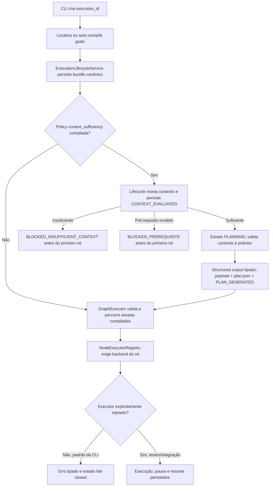

# Walkthrough da Estrutura e dos Fluxos Atuais

> **Status: mapa do protótipo em 8 de agosto de 2026**

Este walkthrough mostra a organização real do repositório e distingue o que é código executável do
que é arquitetura futura. O [dashboard HTML](walkthrough_dashboard.html) é um artefato visual
histórico e não deve ser usado como fonte de status.

## Estrutura relevante

```text
ai-engineering-harness/
├── README.md
├── TASK.md
├── pyproject.toml
├── uv.lock
├── compiler/
│   ├── compile.py
│   └── validators/
├── docs/
├── src/ai_engineering_harness/
│   ├── cli/
│   ├── compiler/
│   ├── contracts/
│   ├── defaults/
│   │   ├── agents/
│   │   ├── graphs/
│   │   ├── policies/
│   │   └── tools/
│   ├── doctor/
│   ├── governance/
│   ├── indexer/
│   ├── models/
│   ├── observability/
│   ├── runtime/
│   ├── security/
│   ├── tools/
│   ├── verification/
│   └── workspace/
└── tests/
    ├── e2e/
    ├── fixtures/
    └── unit/
```

Não existem os diretórios autorais de raiz `contracts/` ou `policies/`. Os contratos e defaults
canônicos atuais ficam dentro do pacote. Especificações padrão de grafo ficam em
`src/ai_engineering_harness/defaults/graphs/`; `.harness/graphs/specs/` é criado no repositório
de destino por `harness init`.

## Fluxo de `harness init`

1. usa o diretório atual como raiz;
2. cria a árvore `.harness/`;
3. copia defaults de agents, graphs, policies e tools quando ainda não existem;
4. cria `.harness/project.yaml` com defaults Python/pytest.

Esse scaffold é um efeito real. Ainda faltam validação do repositório, migração transacional,
manifesto de versão e rollback de inicialização previstos na F7.

## Fluxo de `harness run`



Limitações importantes:

- o runtime percorre nós/arestas pelo `GraphExecutor`, mas a CLI constrói um registry de executores
  deliberadamente vazio e falha antes de efeitos;
- os quatro workflows F4.3 exigem envelope exato `context_request + graph_input`; a decisão usa a
  policy resolvida do artefato, o snapshot do commit e os manifestos de conhecimento, com até duas
  retomadas além da tentativa inicial;
- a F4.4 promovida valida rota/egress, relê evidência por digest, exige plano tipado
  limitado às policies compiladas e persiste payload/projeção/eventos antes de entregar `graph_input`;
- a F4.5 promovida normaliza os IDs e bloqueia suítes vazias/desconhecidas/duplicadas; a F4.6
  promovida resolve configuração/argv e pré-requisitos no worktree antes de efeitos;
- providers e tools reais existem como dependências injetáveis, mas o caminho padrão não os compõe;
- o `ToolRouter` operacional não é construído automaticamente pelo lifecycle;
- promoção permanece sintética; a indexação Python é real e commit-bound e a F4.3 consome seu snapshot,
  mas o lifecycle ainda não executa `harness index` automaticamente;
- o worktree Git existe como primitiva, mas ainda não é criado/injetado nessa sequência.

## Fluxo de verificação

O `VerificationEngine` possui runners que executam processos reais pelo terminal tipado, com `argv`,
cwd confinado, ambiente seletivo, timeout da árvore e saída limitada/redigida. F4.5 remove o falso
sucesso `0/0`; F4.6 exige `ProvisionedWorktree`, resolve a suíte inteira antes de efeitos e transforma
pré-requisito ausente em `ERROR_PREREQUISITE`; F4.7 persiste cada resultado e impede conclusão sem
suíte obrigatória aprovada. A F4.8 promovida recupera a última reprovação canônica, agenda somente o
`on_failure` compilado com contexto redigido e orçamento durável, executa primeiro os gates reprovados
e exige a suíte integral no mesmo commit limpo antes de `COMPLETED`. O E2E prova crash-resume sem
duplicar o efeito e exaustão por nó, execução, tokens, custo e deadline. A composição automática de
worktree/provider/tools permanece pendente.

## Fluxo de auditoria e rollback

O diário append-only e sua hash chain são implementações locais testadas. O rollback registra eventos,
mas ainda usa um adapter Git legado incompatível com o terminal tipado e não recebe o worktree real,
candidate commit ou gates pós-reversão. Portanto, o fluxo serve para testes do protocolo, não para
recuperação confiável de um produto.

## Onde acompanhar

- [TASK.md](../TASK.md): primeira tarefa pendente e checkpoints;
- [Plano operacional](plano_implementacao_harness_operacional.md): dependências e critérios concretos;
- [Auditoria do ciclo](agentic_lifecycle_audit.md): classificação por etapa.
